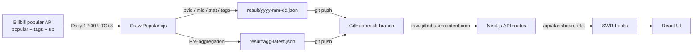

<div align="center">
  
  <h1 align="center">BiliBili-Analyzer</h1>
  <h3>Multi-dimensional retrieval & aggregation analytics for Bilibili popular videos</h3>
  <a href="https://bilibili-analyzer.vercel.app/"><strong>Live demo</strong></a> · <a href="./docs/"><strong>Docs</strong></a> · <a href="https://github.com/BlackishGreen33/BiliBili-Analyzer/issues">Report a bug</a>
  <br />
  <br />


</div>

---

> [简体中文](./README.md) · [English](./README.en.md)

---

## Overview

A multi-dimensional retrieval and aggregation analytics system for
[Bilibili](https://www.bilibili.com)'s public popular-videos ranking.
A daily GitHub Actions cron crawls the top 1000 videos plus UP 主
metadata every day at 12:00 (UTC+8). The system provides:

- **Multi-dimensional search** by keyword, primary/secondary channel,
  tag, and date.
- **Aggregation dashboard** with channel distribution, UP 主
  leaderboard, engagement rate, publish-hour heatmap, duration
  histogram, and tag cloud.
- **Per-video detail page** with 7-metric engagement signature and
  related videos (same UP / same channel).
- **Cross-day compare** (2-day diff), **cross-day trend** (90-day),
  **UP cross-channel ranking**, and **video-length prediction**.

## Quick start

```bash
$ git clone https://github.com/BlackishGreen33/BiliBili-Analyzer.git
$ cd BiliBili-Analyzer
$ pnpm install
$ pnpm dev
```

Open http://localhost:3000.

> Requires `Node.js >= 20` and `pnpm >= 9`.

## Data flow



> Full architecture in [docs/architecture.en.md](./docs/architecture.en.md) /
> [docs/architecture.md](./docs/architecture.md) (Simplified Chinese).

## Tech stack

| Concern       | Stack                                                   |
| ------------- | ------------------------------------------------------- |
| Framework     | Next.js 16 (App Router) / React 19 / TypeScript 5.9     |
| Styling       | Tailwind CSS v4 + shadcn/ui (Radix Primitives)          |
| Charts        | Recharts 2.15                                           |
| Word cloud    | react-d3-cloud                                          |
| Data fetching | SWR 2 + Zod 3 schema validation                         |
| State         | Zustand 5 (split into 3 stores)                         |
| Fonts         | Geist Sans + Geist Mono + Noto Sans SC                  |
| Crawler       | Node.js + axios, exponential backoff                    |
| Deployment    | Vercel + GitHub Actions (daily cron)                    |
| Mobile        | Capacitor 8 (via `pnpm build:mobile`)                   |
| Code quality  | ESLint 9 (flat config) + Prettier + Husky + lint-staged |

## Directory structure

```
BiliBili-Analyzer/
├── CrawlPopular.cjs          # Daily Node.js crawler
├── public/                   # Static assets (icon, qrcode, OG image)
├── scripts/
│   └── build-mobile.mjs      # Capacitor build orchestration
├── src/
│   ├── app/                  # Next.js App Router
│   │   ├── (main)/page.tsx  # / (search + grid)
│   │   ├── details/page.tsx  # /details?bvid=...
│   │   ├── dashboard/        # /dashboard + /compare + /trend + /ups
│   │   ├── api/              # 13 server routes
│   │   ├── error.tsx
│   │   ├── not-found.tsx
│   │   └── layout.tsx
│   ├── common/
│   │   ├── components/      # UI shell (sidebar, navbar, ui primitives, ...)
│   │   ├── hooks/           # useThemeStore / useLayoutStore / useUiStore
│   │   ├── libs/            # result-data / video-data / use-* SWR hooks /
│   │   │                    #   routes/ (pure helpers for API)
│   │   ├── providers/       # Providers (next-themes only)
│   │   ├── styles/          # globals.css
│   │   ├── types/           # video.ts / bilibili.ts / schema.ts (Zod)
│   │   └── utils/           # format / cjk-segmenter / search-filters
│   └── modules/              # Page-level modules
│       ├── Home/             # Mounts Search (dynamic, ssr:false)
│       ├── Search/           # Filter + virtualized grid
│       └── Detail/           # Video player + 7 metrics + WordCloud + related
├── docs/                     # Bilingual docs (Simplified Chinese + English)
├── PRODUCT.md                # Strategic product brief
├── DESIGN.md                 # Visual design tokens
├── next.config.mjs
├── tailwind.config           # v4 inline @theme
├── tsconfig.json             # strict + ES2022
├── eslint.config.mjs         # flat config, all rules re-enabled
├── vitest.config.ts          # 94 / 90 / 95 / 94 thresholds
└── package.json
```

## Available scripts

| Command                | Description                                               |
| ---------------------- | --------------------------------------------------------- |
| `pnpm dev`             | Start dev server (Turbopack)                              |
| `pnpm build`           | Production build                                          |
| `pnpm start`           | Run production build                                      |
| `pnpm lint`            | ESLint (flat config)                                      |
| `pnpm prettier`        | Prettier format                                           |
| `pnpm test`            | Vitest run all unit + RTL + API tests once                |
| `pnpm test:watch`      | Vitest watch mode                                         |
| `pnpm test:coverage`   | Vitest + v8 coverage report                               |
| `pnpm crawldata`       | Crawl today's popular + UP meta + pre-aggregation         |
| `pnpm mock-second-day` | Copy yesterday's fake data (for cross-day compare QA)     |
| `pnpm mock-n-days`     | Copy N days of fake data (trend / overlap QA, default 30) |
| `pnpm build:mobile`    | Temp patch `next.config.mjs` → static export → cap sync   |

## Tests

Vitest 2.x + happy-dom + @testing-library/react. **381 tests** covering:

- `src/common/utils/{format,cjk-segmenter,search-filters}.test.ts` — pure functions (70)
- `src/common/types/schema.test.ts` — Zod schema accept/reject (10)
- `src/common/libs/{result-data.server,length-predictor,streaming,dashboard-stream}.test.ts` — pure fns + hook (15 + 6 + 18 + 9)
- `src/common/libs/{use-dashboard,use-dashboard-trend,use-wordcloud,use-up-overlap,use-latency,use-length-recommend}.test.ts` — SWR hook per-file (24)
- `src/common/libs/routes/*.test.ts` — 7 pure route helper unit tests (77)
- `src/common/hooks/{useLayoutStore,useThemeStore,useUiStore}.test.ts` — zustand store (8)
- `src/common/i18n/i18n-shape.test.ts` — 3-locale leaf key consistency (8)
- `src/common/utils/search-filters.test.ts` — filter / encode / decode (19)
- `src/modules/Search/hooks/{useSearchFilters,useInfiniteScroll}.test.ts` — hook (22)
- `src/modules/Detail/components/{Analization,Base,Video,SearchBar,Detail,StackedChart,WordCloud,VideoInfo}.test.tsx` — Detail RTL (22)
- `src/modules/Search/components/Search.test.tsx` — Search RTL (9)
- `src/modules/Home/components/Home.test.tsx` — Home RTL (1)
- `src/common/components/elements/{SkipToContent,ThemeSettings,SummaryCard,LengthRecommendCard}.test.tsx` — element RTL (20)
- `src/app/api/api-routes.test.ts` — 13 server routes including catch path (41)

Coverage thresholds in `vitest.config.ts` (currently **95% lines / 90% branches / 95% functions / 95% statements**,
with exclude list). CI runs `pnpm test:coverage` after `pnpm lint`; failure if under threshold.

> The exclude list keeps "untouched legacy API / pure layout chrome / container components that distort function coverage through heavy mocking".
> See comments in `vitest.config.ts`. To push higher coverage, add files back to `include` and write tests for them.

## Data crawler

`CrawlPopular.cjs` end-to-end flow:

1. Pull Bilibili popular `/x/web-interface/popular` first 50 pages (≤ 1000 videos)
2. For each video, concurrently fetch `/x/tag/archive/tags` (8 concurrent) for tags
3. Dedupe UP 主, then concurrently fetch `/x/relation/stat` + `/x/space/wbi/acc/info`
   (6 concurrent) for followers, signature, official type
4. Compute 7 pre-aggregation dimensions (summary / channels / topUps / duration /
   hourHeatmap / topTags / topEngagement) → `result/agg-latest.json`
5. Maintain `result/list.json` pointer

All requests use exponential backoff (1s → 2.5s → 5s). GitHub Actions
`.github/workflows/crawl.yml` runs daily at 12:00 UTC+8 and pushes to
the `result` orphan branch.

> Full reference in [docs/crawler.en.md](./docs/crawler.en.md) /
> [docs/crawler.md](./docs/crawler.md) (Simplified Chinese).

## Data analysis dimensions

`/dashboard` provides the following views:

| View                 | Source      | Computation                                              |
| -------------------- | ----------- | -------------------------------------------------------- |
| 4 KPI cards          | daily       | total videos / total UP / total views / total engagement |
| Channel pie          | pre-agg     | first-channel hot video counts                           |
| UP leaderboard (bar) | pre-agg     | today's count TOP 10                                     |
| Duration histogram   | pre-agg     | 7 buckets (<1, 1-3, 3-5, 5-10, 10-20, 20-30, >30 min)    |
| Hour-of-day (bar)    | pre-agg     | 24 hours (UTC+8)                                         |
| Hot tags (badge)     | pre-agg     | tag count TOP 20                                         |
| UP ranking (table)   | pre-agg     | count + total views + followers                          |
| Engagement TOP 10    | pre-agg     | (like + 2·coin + 2·favorite + share) / view              |
| Trend (line)         | N-day agg   | 6 metrics LineChart + 7-bucket duration AreaChart        |
| Compare (diff)       | 2-day agg   | B-A delta + 5 metrics + channel / UP / tag shift         |
| UP overlap (table)   | N-day agg   | UP appearing in ≥2 first-channels                        |
| Latency (bar)        | N-day agg   | 0/1/2/3/4/5/6-7/8-14/15-30/30+ days                      |
| Word cloud           | daily title | Intl.Segmenter('zh') + n-gram 2-3 + top 200              |
| Length prediction    | N-day agg   | median + IQR, low/mid/high confidence                    |

## Documentation

| Doc          | Simplified Chinese                             | English                                              |
| ------------ | ---------------------------------------------- | ---------------------------------------------------- |
| Architecture | [docs/architecture.md](./docs/architecture.md) | [docs/architecture.en.md](./docs/architecture.en.md) |
| Data schema  | [docs/data-schema.md](./docs/data-schema.md)   | [docs/data-schema.en.md](./docs/data-schema.en.md)   |
| Crawler      | [docs/crawler.md](./docs/crawler.md)           | [docs/crawler.en.md](./docs/crawler.en.md)           |
| Analysis     | [docs/analysis.md](./docs/analysis.md)         | [docs/analysis.en.md](./docs/analysis.en.md)         |
| API          | [docs/api.md](./docs/api.md)                   | [docs/api.en.md](./docs/api.en.md)                   |
| Deployment   | [docs/deployment.md](./docs/deployment.md)     | [docs/deployment.en.md](./docs/deployment.en.md)     |
| Development  | [docs/development.md](./docs/development.md)   | [docs/development.en.md](./docs/development.en.md)   |

Design and product context:

- [PRODUCT.md](./PRODUCT.md) — Strategic layer (audience, brand persona, anti-references)
- [DESIGN.md](./DESIGN.md) — Visual layer (color, typography, spacing, anti-slop)

## Browser support

- Chrome / Edge ≥ 90
- Firefox ≥ 90
- Safari ≥ 15
- iOS Safari ≥ 15
- Android Chrome ≥ 90

## License

MIT — see [LICENSE](./LICENSE).

> This project is a read-only analytics tool over Bilibili's public popular
> ranking. **No user data is stored.** All data comes from Bilibili's public
> APIs and the GitHub `result` branch.
