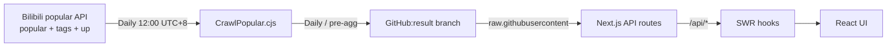

<div align="center">
  
  <h1>BiliBili-Analyzer</h1>
  <p><strong>📊 A read-only observatory for Bilibili's public popular ranking — search, slice, compare.</strong></p>
  <p>
    <a href="https://bilibili-analyzer.vercel.app/">Live demo</a> ·
    <a href="./docs/">Documentation</a> ·
    <a href="https://github.com/BlackishGreen33/BiliBili-Analyzer/issues">Report a bug</a>
  </p>


</div>

---

> [简体中文](./README.md) · [English](./README.en.md)

---

## ✨ Features

- 🔍 **Multi-dimensional search** — keyword, primary/secondary channel, tag, and date
- 📊 **Daily aggregation dashboard** — 4 KPIs + channel pie + UP leaderboard + duration / hour / tag distribution
- 🎬 **Per-video depth page** — 7 engagement metrics + same-UP / same-channel related videos
- 📅 **Cross-day compare & 90-day trend** — 2-day diff + 6-metric LineChart
- 🎯 **UP cross-channel + length prediction** — IQR confidence interval + recommended duration
- 🌐 **Trilingual UI** — 简体中文 / 繁體中文 / English
- 📱 **Mobile** — Android / iOS via `pnpm build:mobile` (Capacitor 8)

## 📺 Screenshots

|              Search grid               |              Aggregation dashboard               |                Video detail                |
| :------------------------------------: | :----------------------------------------------: | :----------------------------------------: |
|  |  |  |

## 🤔 Why this exists

Bilibili's homepage is algorithmically curated. We wanted a **non-algorithmic
entry point** for data-curious users that answers three questions fast:

- What's hot right now? (per-day list)
- How do channels / UPs / hour-of-day compare? (dashboard)
- What is this single video's engagement signature? (detail page)

We are **not** a Bilibili client, **not** a video player, **not** a
recommendation engine. We are the Bloomberg Terminal for Bilibili's
popular ranking — `cold` / `precise` / `honest`.

## 🚀 Quick start

```bash
git clone https://github.com/BlackishGreen33/BiliBili-Analyzer
cd BiliBili-Analyzer
pnpm install
pnpm dev          # http://localhost:3000
```

> Requires `Node.js >= 20` and `pnpm >= 9`.

## 🏗️ Architecture



> Full reference in [docs/architecture.en.md](./docs/architecture.en.md).

## 🛠️ Tech stack

| Concern   | Stack                                               |
| --------- | --------------------------------------------------- |
| Framework | Next.js 16 (App Router) · React 19 · TypeScript 5.9 |
| Styling   | Tailwind CSS v4 · shadcn/ui (Radix Primitives)      |
| Charts    | Recharts 2.15 · react-d3-cloud                      |
| Data      | SWR 2 · Zod 3 schema validation                     |
| State     | Zustand 5 (3 stores)                                |
| Deploy    | Vercel · GitHub Actions (daily cron)                |
| Mobile    | Capacitor 8                                         |

## 🧪 For developers

```bash
pnpm dev               # Dev server (Turbopack)
pnpm test              # Vitest, all unit + RTL + API tests
pnpm test:coverage     # v8 coverage report
pnpm crawldata         # Crawl today's popular (writes to result/)
pnpm build:mobile      # Capacitor static export
```

→ Full guide in [docs/development.en.md](./docs/development.en.md).

## 📚 Documentation

| Doc          | 简体中文                                       | English                                              |
| ------------ | ---------------------------------------------- | ---------------------------------------------------- |
| Architecture | [docs/architecture.md](./docs/architecture.md) | [docs/architecture.en.md](./docs/architecture.en.md) |
| Data schema  | [docs/data-schema.md](./docs/data-schema.md)   | [docs/data-schema.en.md](./docs/data-schema.en.md)   |
| Crawler      | [docs/crawler.md](./docs/crawler.md)           | [docs/crawler.en.md](./docs/crawler.en.md)           |
| Analysis     | [docs/analysis.md](./docs/analysis.md)         | [docs/analysis.en.md](./docs/analysis.en.md)         |
| API          | [docs/api.md](./docs/api.md)                   | [docs/api.en.md](./docs/api.en.md)                   |
| Deployment   | [docs/deployment.md](./docs/deployment.md)     | [docs/deployment.en.md](./docs/deployment.en.md)     |

## 🎨 Design philosophy

- The brand pink is a single dot of identity, used on ≤ 8% of the surface
- Numbers are written with thousands separators + units (`119.6 万`), never raw integers
- "Hot" / "trending" only appear when describing a derived metric
- Anti-references: not bilibili.com, not a SaaS landing page, not an AI dashboard template
- Full spec in [DESIGN.md](./DESIGN.md) + [PRODUCT.md](./PRODUCT.md)

## 📦 Deployment

- **Web** — Vercel (auto-deploy on `main` push)
- **Data crawler** — GitHub Actions, daily 12:00 UTC+8 cron
- **Mobile** — `pnpm build:mobile` (Capacitor 8) → Android / iOS

→ See [docs/deployment.en.md](./docs/deployment.en.md).

## 📄 License

MIT — see [LICENSE](./LICENSE).

> This project is a read-only analytics tool over Bilibili's public popular
> ranking. **No user data is stored.** All data comes from Bilibili's public
> APIs and the GitHub `result` branch.
