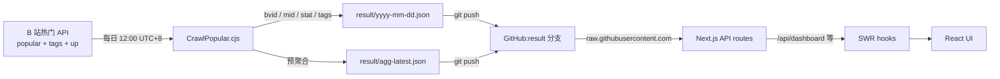

<div align="center">
  
  <h1 align="center">BiliBili-Analyzer</h1>
  <h3>B 站近期热门视频分类检索分析系统</h3>
  <a href="https://bilibili-analyzer.vercel.app/"><strong>在线体验</strong></a> · <a href="./docs/"><strong>浏览文档</strong></a> · <a href="https://github.com/BlackishGreen33/BiliBili-Analyzer/issues">报告 Bug</a>
  <br />
  <br />


</div>

---

> [简体中文](./README.md) · [English](./README.en.md)

---

## 项目简介 / Overview

一个基于 [Bilibili](https://www.bilibili.com) 公开热门榜单的多维检索与聚合分析系统。每天 12:00 (UTC+8) 自动抓取当日热门 Top 1000 视频 + UP 主元数据，提供：

- 多维检索（关键字 + 一级/二级分区 + 标签 + 日期）
- 聚合分析（分区占比、UP 主上榜榜、互动率、发布时段、时长分布、标签云）
- 单视频深度页（7 项互动指标 + 同 UP 主 / 同分区其他上榜视频）
- 跨日对比（2 天 diff）、跨日时序（90 天）、UP 跨分区、视频长度预测

## 快速开始 / Quick start

```bash
$ git clone https://github.com/BlackishGreen33/BiliBili-Analyzer.git
$ cd BiliBili-Analyzer
$ pnpm install
$ pnpm dev
```

打开 http://localhost:3000 即可。

> 需要 `Node.js >= 20` 和 `pnpm >= 9`.

## 数据流 / Data flow



> 完整说明见 [docs/architecture.md](./docs/architecture.md) (简体中文) /
> [docs/architecture.en.md](./docs/architecture.en.md) (English).

## 技术栈 / Tech stack

| 范畴 / Concern         | 技术 / Stack                                            |
| ---------------------- | ------------------------------------------------------- |
| 框架 Framework         | Next.js 16 (App Router) / React 19 / TypeScript 5.9     |
| 样式 Styling           | Tailwind CSS v4 + shadcn/ui (Radix Primitives)          |
| 图表 Charts            | Recharts 2.15                                           |
| 词云 Word cloud        | react-d3-cloud                                          |
| 数据抓取 Data fetching | SWR 2 + Zod 3 schema validation                         |
| 状态 State             | Zustand 5 (split into 3 stores)                         |
| 字体 Fonts             | Geist Sans + Geist Mono + Noto Sans SC                  |
| 数据采集 Crawler       | Node.js + axios, exponential backoff                    |
| 部署 Deployment        | Vercel + GitHub Actions (daily cron)                    |
| 移动端 Mobile          | Capacitor 8 (via `pnpm build:mobile`)                   |
| 代码质量 Quality       | ESLint 9 (flat config) + Prettier + Husky + lint-staged |

## 目录结构 / Directory structure

```
BiliBili-Analyzer/
├── CrawlPopular.cjs          # Daily Node.js crawler
├── public/                   # Static assets (icon, qrcode, OG image)
├── scripts/
│   └── build-mobile.mjs      # Capacitor build orchestration
├── src/
│   ├── app/                  # Next.js App Router
│   │   ├── (main)/page.tsx  # / (search + grid)
│   │   ├── details/page.tsx  # /details?bvid=...
│   │   ├── dashboard/        # /dashboard + /compare + /trend + /ups
│   │   ├── api/              # 13 server routes
│   │   ├── error.tsx
│   │   ├── not-found.tsx
│   │   └── layout.tsx
│   ├── common/
│   │   ├── components/      # UI shell (sidebar, navbar, ui primitives, ...)
│   │   ├── hooks/           # useThemeStore / useLayoutStore / useUiStore
│   │   ├── libs/            # result-data / video-data / use-* SWR hooks /
│   │   │                    #   routes/ (pure helper for API)
│   │   ├── providers/       # Providers (next-themes only)
│   │   ├── styles/          # globals.css
│   │   ├── types/           # video.ts / bilibili.ts / schema.ts (Zod)
│   │   └── utils/           # format / cjk-segmenter / search-filters
│   └── modules/              # Page-level modules
│       ├── Home/             # Mounts Search (dynamic, ssr:false)
│       ├── Search/           # Filter + virtualized grid
│       └── Detail/           # Video player + 7 metrics + WordCloud + related
├── docs/                     # 双语文档 (简体中文 + English)
├── PRODUCT.md                # Strategic product brief
├── DESIGN.md                 # Visual design tokens
├── next.config.mjs
├── tailwind.config           # v4 inline @theme
├── tsconfig.json             # strict + ES2022
├── eslint.config.mjs         # flat config, all rules re-enabled
├── vitest.config.ts          # 94 / 90 / 95 / 94 thresholds
└── package.json
```

## 可用脚本 / Available scripts

| 命令                   | 说明                                                        |
| ---------------------- | ----------------------------------------------------------- |
| `pnpm dev`             | 启动开发服务器 (Turbopack)                                  |
| `pnpm build`           | 生产构建                                                    |
| `pnpm start`           | 启动生产服务                                                |
| `pnpm lint`            | ESLint (flat config)                                        |
| `pnpm prettier`        | Prettier 格式化                                             |
| `pnpm test`            | Vitest 跑一次所有 unit + RTL + API 测试                     |
| `pnpm test:watch`      | Vitest watch 模式                                           |
| `pnpm test:coverage`   | Vitest + v8 coverage report                                 |
| `pnpm crawldata`       | 抓取当日热门 + UP 主 + 预聚合 (写入 `result/`)              |
| `pnpm mock-second-day` | 拷昨日假数据（QA 跨日对比用）                               |
| `pnpm mock-n-days`     | 拷 N 天假数据（QA 时序图 / 跨分区用，默认 30）              |
| `pnpm build:mobile`    | 临时 patch `next.config.mjs` → 静态导出 → `cap sync` → 还原 |

## 测试 / Tests

Vitest 2.x + happy-dom + @testing-library/react。**381 个测试**覆盖：

- `src/common/utils/{format,cjk-segmenter,search-filters}.test.ts` — 纯函数 (70)
- `src/common/types/schema.test.ts` — Zod schema accept/reject (10)
- `src/common/libs/{result-data.server,length-predictor,streaming,dashboard-stream}.test.ts` — 纯函数 + hook (15 + 6 + 18 + 9)
- `src/common/libs/{use-dashboard,use-dashboard-trend,use-wordcloud,use-up-overlap,use-latency,use-length-recommend}.test.ts` — SWR hook 单独测试 (24)
- `src/common/libs/routes/*.test.ts` — 7 个 pure route helper 单元测试 (77)
- `src/common/hooks/{useLayoutStore,useThemeStore,useUiStore}.test.ts` — zustand store (8)
- `src/common/i18n/i18n-shape.test.ts` — 三语字典 leaf key 一致性 (8)
- `src/common/utils/search-filters.test.ts` — 过滤/编码/解码 (19)
- `src/modules/Search/hooks/{useSearchFilters,useInfiniteScroll}.test.ts` — hook (22)
- `src/modules/Detail/components/{Analization,Base,Video,SearchBar,Detail,StackedChart,WordCloud,VideoInfo}.test.tsx` — Detail RTL (22)
- `src/modules/Search/components/Search.test.tsx` — Search RTL (9)
- `src/modules/Home/components/Home.test.tsx` — Home RTL (1)
- `src/common/components/elements/{SkipToContent,ThemeSettings,SummaryCard,LengthRecommendCard}.test.tsx` — 元素 RTL (20)
- `src/app/api/api-routes.test.ts` — 13 个 server route 包含 catch path (41)

Coverage 阈值见 `vitest.config.ts`（目前 **95% lines / 90% branches / 95% functions / 95% statements**，
含排除清单）。CI 会在 `pnpm lint` 后跑 `pnpm test:coverage`，未达阈值 fail。

> 排除清单保留「非本轮触碰的旧 API / 纯 layout chrome / 高度 mock 化使函数覆盖率失真的容器组件」。
> 详见 `vitest.config.ts` 注释。下一轮若要推高覆盖率，把对应文件加回 `include` 并补测试即可。

## 数据采集 / Data crawler

`CrawlPopular.cjs` 完整流程：

1. 拉取 B 站热门 `/x/web-interface/popular` 前 50 页（最多 1000 支）
2. 对每支视频并发请求 `/x/tag/archive/tags`（8 并发）补齐普通标签
3. 去重 UP 主后并发请求 `/x/relation/stat` + `/x/space/wbi/acc/info`
   （6 并发）补齐粉丝数、签名、认证类型
4. 计算 7 个预聚合维度（summary / channels / topUps / duration /
   hourHeatmap / topTags / topEngagement）写入 `result/agg-latest.json`
5. 维护 `result/list.json` 指针

所有请求使用 exponential backoff（1s → 2.5s → 5s）。GitHub Actions
`.github/workflows/crawl.yml` 每天 12:00 UTC+8 自动执行并 push 到
`result` orphan 分支。

> 完整说明见 [docs/crawler.md](./docs/crawler.md) / [docs/crawler.en.md](./docs/crawler.en.md).

## 数据分析维度 / Data analysis dimensions

`/dashboard` 提供以下分析：

| 视图                | 数据源   | 计算                                                    |
| ------------------- | -------- | ------------------------------------------------------- |
| 4 个关键指标卡      | 当日结果 | 总视频、上榜 UP、总播放、互动量                         |
| 分区占比 (pie)      | 预聚合   | 一级分区热门视频数                                      |
| UP 主上榜榜 (bar)   | 预聚合   | 当日上榜次数 TOP 10                                     |
| 时长分布 (bar)      | 预聚合   | 7 桶直方图（<1 min, 1-3, 3-5, 5-10, 10-20, 20-30, >30） |
| 发布时段 (bar)      | 预聚合   | 24 小时（UTC+8）                                        |
| 热门标签 (badge)    | 预聚合   | 标签出现次数 TOP 20                                     |
| UP 主排行榜 (table) | 预聚合   | 上榜次数 + 总播放 + 粉丝数                              |
| 互动率 TOP 10       | 预聚合   | (like + 2·coin + 2·favorite + share) / view             |
| 时序 (line)         | N 天聚合 | 6 指标 LineChart + 7 桶时长 AreaChart                   |
| 跨日对比 (diff)     | 2 天聚合 | B-A delta + 5 metric + 分区/UP/标签 shift               |
| UP 跨分区 (table)   | N 天聚合 | 出现 ≥2 个一级分区的 UP 主                              |
| 延迟直方图 (bar)    | N 天聚合 | 0/1/2/3/4/5/6-7/8-14/15-30/30+ 天                       |
| 词云 (cloud)        | 当日标题 | Intl.Segmenter('zh') + n-gram 2-3 + top 200             |
| 长度预测 (card)     | N 天聚合 | 中位数 + IQR 信区间，low/mid/high confidence            |

## 文档导航 / Documentation

| 文档                 | 简体中文                                       | English                                              |
| -------------------- | ---------------------------------------------- | ---------------------------------------------------- |
| 架构 Architecture    | [docs/architecture.md](./docs/architecture.md) | [docs/architecture.en.md](./docs/architecture.en.md) |
| 资料字典 Data schema | [docs/data-schema.md](./docs/data-schema.md)   | [docs/data-schema.en.md](./docs/data-schema.en.md)   |
| 爬虫设计 Crawler     | [docs/crawler.md](./docs/crawler.md)           | [docs/crawler.en.md](./docs/crawler.en.md)           |
| 分析指标 Analysis    | [docs/analysis.md](./docs/analysis.md)         | [docs/analysis.en.md](./docs/analysis.en.md)         |
| API 合约 API         | [docs/api.md](./docs/api.md)                   | [docs/api.en.md](./docs/api.en.md)                   |
| 部署 Deployment      | [docs/deployment.md](./docs/deployment.md)     | [docs/deployment.en.md](./docs/deployment.en.md)     |
| 开发指南 Development | [docs/development.md](./docs/development.md)   | [docs/development.en.md](./docs/development.en.md)   |

设计与产品语境：

- [PRODUCT.md](./PRODUCT.md) — 战略层（受众、品牌个性、反参考）
- [DESIGN.md](./DESIGN.md) — 视觉层（色彩、字体、间距、反 slop）

## 兼容环境 / Browser support

- Chrome / Edge ≥ 90
- Firefox ≥ 90
- Safari ≥ 15
- iOS Safari ≥ 15
- Android Chrome ≥ 90

## 授权 / License

MIT — 详见 [LICENSE](./LICENSE) 文件。

> 本项目仅做 B 站公开热门榜单检索分析，**不存储任何用户隐私数据**。
> 数据源全部来自 B 站公开 API 与 GitHub `result` 分支。
