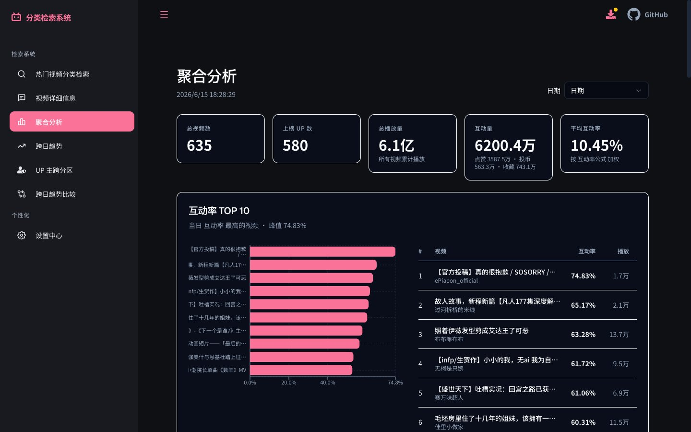
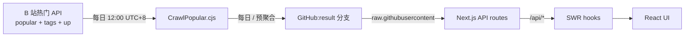

<div align="center">
  
  <h1>BiliBili-Analyzer</h1>
  <p><strong>📊 B 站近期热门视频的观测站 — search, slice, compare.</strong></p>
  <p>
    <a href="https://bilibili-analyzer.vercel.app/">在线体验</a> ·
    <a href="./docs/">浏览文档</a> ·
    <a href="https://github.com/BlackishGreen33/BiliBili-Analyzer/issues">报告 Bug</a>
  </p>


</div>

---

> [简体中文](./README.md) · [English](./README.en.md)

---

## ✨ Features

- 🔍 **多维检索** — 关键字 + 一级/二级分区 + 标签 + 日期
- 📊 **单日聚合仪表板** — 4 个 KPI + 分区占比 + UP 榜 + 时长/时段/标签分布
- 🎬 **单视频深度页** — 7 项互动指标 + 同 UP / 同分区其他上榜
- 📅 **跨日对比 & 90 天时序** — 2 天 diff + 6 指标 LineChart
- 🎯 **UP 跨分区 + 长度预测** — IQR 信赖区间 + 视频长度建议
- 🌐 **三语 UI** — 简体中文 / 繁體中文 / English
- 📱 **移动端** — Android / iOS via `pnpm build:mobile` (Capacitor 8)

## 📺 Screenshots

|                热门检索                |                     聚合分析                     |                  视频详情                  |
| :------------------------------------: | :----------------------------------------------: | :----------------------------------------: |
|  |  |  |

## 🤔 Why this exists

B 站首页是经过算法策划的;我们想给数据敏感的用户一个**无算法干预的入口**,
快速回答三件事:

- 今天什么最热?(单日列表)
- 不同分类 / UP / 时段怎么对比?(仪表板)
- 单个视频的互动签名是什么?(详情页)

我们**不**做 B 站客户端、**不**做视频播放器、**不**做推荐引擎。
我们做 B 站热门的 Bloomberg Terminal —— `cold` / `precise` / `honest`。

## 🚀 Quick start

```bash
git clone https://github.com/BlackishGreen33/BiliBili-Analyzer
cd BiliBili-Analyzer
pnpm install
pnpm dev          # http://localhost:3000
```

> 需要 `Node.js >= 20` 和 `pnpm >= 9`。

## 🏗️ Architecture



> 完整说明见 [docs/architecture.md](./docs/architecture.md)。

## 🛠️ Tech stack

| 范畴      | 技术                                                |
| --------- | --------------------------------------------------- |
| Framework | Next.js 16 (App Router) · React 19 · TypeScript 5.9 |
| Styling   | Tailwind CSS v4 · shadcn/ui (Radix Primitives)      |
| Charts    | Recharts 2.15 · react-d3-cloud                      |
| Data      | SWR 2 · Zod 3 schema validation                     |
| State     | Zustand 5 (3 stores)                                |
| Deploy    | Vercel · GitHub Actions (daily cron)                |
| Mobile    | Capacitor 8                                         |

## 🧪 For developers

```bash
pnpm dev               # 开发服务器 (Turbopack)
pnpm test              # Vitest 跑所有测试
pnpm test:coverage     # v8 coverage
pnpm crawldata         # 抓取当日热门 (写入 result/)
pnpm build:mobile      # Capacitor 静态汇出
```

→ 完整开发指南见 [docs/development.md](./docs/development.md)。

## 📚 Documentation

| 文档                 | 简体中文                                       | English                                              |
| -------------------- | ---------------------------------------------- | ---------------------------------------------------- |
| 架构 Architecture    | [docs/architecture.md](./docs/architecture.md) | [docs/architecture.en.md](./docs/architecture.en.md) |
| 资料字典 Data schema | [docs/data-schema.md](./docs/data-schema.md)   | [docs/data-schema.en.md](./docs/data-schema.en.md)   |
| 爬虫设计 Crawler     | [docs/crawler.md](./docs/crawler.md)           | [docs/crawler.en.md](./docs/crawler.en.md)           |
| 分析指标 Analysis    | [docs/analysis.md](./docs/analysis.md)         | [docs/analysis.en.md](./docs/analysis.en.md)         |
| API 合约 API         | [docs/api.md](./docs/api.md)                   | [docs/api.en.md](./docs/api.en.md)                   |
| 部署 Deployment      | [docs/deployment.md](./docs/deployment.md)     | [docs/deployment.en.md](./docs/deployment.en.md)     |

## 🎨 Design philosophy

- 品牌粉作 dot of identity,使用面积 ≤ 8% 表面
- 数字用千分位 + 单位 (`119.6 万`),不用 raw 整数
- 「热门」/「趋势」只用于描述衍生指标
- 反参考:不是 B 站首页、不是 SaaS landing、不是 AI dashboard 模板
- 完整规范见 [DESIGN.md](./DESIGN.md) + [PRODUCT.md](./PRODUCT.md)

## 📦 Deployment

- **Web**: Vercel (`main` push 自动部署)
- **数据爬取**: GitHub Actions 每日 12:00 UTC+8 cron
- **移动端**: `pnpm build:mobile` (Capacitor 8) → Android / iOS

→ 详见 [docs/deployment.md](./docs/deployment.md)。

## 📄 License

MIT — 见 [LICENSE](./LICENSE)。

> 本项目仅做 B 站公开热门榜单检索分析,**不存储任何用户隐私数据**。
> 数据源全部来自 B 站公开 API 与 GitHub `result` 分支。
